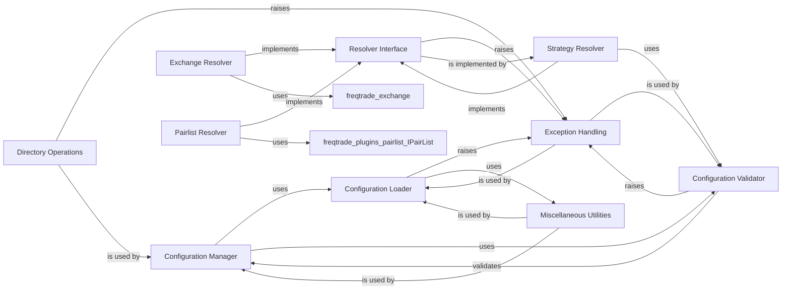

## Component Details

This subsystem is responsible for the critical initial setup of the `freqtrade` bot, encompassing the loading, parsing, validation, and dynamic resolution of its operational configuration and various pluggable components. It ensures that the bot starts with a consistent, valid, and complete set of instructions and functionalities.

### Configuration Manager

The `Configuration` class is the central orchestrator for loading, processing, and providing access to the bot's entire configuration. It consolidates settings from various sources (config files, environment variables, command-line arguments), normalizes them, and applies specific processing based on the `runmode`. It ensures a consistent and validated configuration is available to the rest of the application.

**Related Classes/Methods**:

- <a href="https://github.com/freqtrade/freqtrade/blob/master/freqtrade/configuration/configuration.py#L0-L0" target="_blank" rel="noopener noreferrer">`freqtrade.configuration.configuration.Configuration` (0:0)</a>

### Configuration Loader

This module, primarily through `load_config_file` and `load_from_files`, handles the low-level reading and merging of configuration data from JSON/YAML files. It supports recursive inclusion of other configuration files and manages file system interactions, including error handling for missing files or malformed JSON.

**Related Classes/Methods**:

- <a href="https://github.com/freqtrade/freqtrade/blob/master/freqtrade/configuration/load_config.py#L0-L0" target="_blank" rel="noopener noreferrer">`freqtrade.configuration.load_config.load_config_file` (0:0)</a>

- <a href="https://github.com/freqtrade/freqtrade/blob/master/freqtrade/configuration/load_config.py#L0-L0" target="_blank" rel="noopener noreferrer">`freqtrade.configuration.load_config.load_from_files` (0:0)</a>

### Configuration Validator

The `config_validation` module, with functions like `validate_config_schema` and `validate_config_consistency`, is dedicated to validating the loaded configuration. It checks against predefined JSON schemas for structural correctness and enforces logical consistency rules (e.g., ensuring `max_open_trades` and `stake_amount` are not both unlimited).

**Related Classes/Methods**:

- <a href="https://github.com/freqtrade/freqtrade/blob/master/freqtrade/configuration/config_validation.py#L45-L68" target="_blank" rel="noopener noreferrer">`freqtrade.configuration.config_validation.validate_config_schema` (45:68)</a>

- <a href="https://github.com/freqtrade/freqtrade/blob/master/freqtrade/configuration/config_validation.py#L71-L96" target="_blank" rel="noopener noreferrer">`freqtrade.configuration.config_validation.validate_config_consistency` (71:96)</a>

### Resolver Interface

The `IResolver` class serves as an abstract base for dynamically locating, loading, and validating various pluggable components (like strategies, exchanges, pairlists). It provides common methods for building search paths, finding valid objects within modules, and instantiating them, establishing a standardized mechanism for extending the bot's functionality.

**Related Classes/Methods**:

- <a href="https://github.com/freqtrade/freqtrade/blob/master/freqtrade/resolvers/iresolver.py#L37-L289" target="_blank" rel="noopener noreferrer">`freqtrade.resolvers.iresolver.IResolver` (37:289)</a>

### Strategy Resolver

A concrete implementation of `IResolver` specifically tailored to locate, load, and validate trading strategies (`IStrategy`). It handles strategy-specific configurations, overrides from the main configuration, and performs sanity checks to ensure the loaded strategy adheres to `freqtrade`'s requirements.

**Related Classes/Methods**:

- <a href="https://github.com/freqtrade/freqtrade/blob/master/freqtrade/resolvers/strategy_resolver.py#L0-L0" target="_blank" rel="noopener noreferrer">`freqtrade.resolvers.strategy_resolver.IStrategy` (0:0)</a>

- <a href="https://github.com/freqtrade/freqtrade/blob/master/freqtrade/resolvers/strategy_resolver.py#L0-L0" target="_blank" rel="noopener noreferrer">`freqtrade.resolvers.strategy_resolver.validate_migrated_strategy_settings` (0:0)</a>

### Exchange Resolver

Another concrete implementation of `IResolver`, the `ExchangeResolver` is responsible for loading and initializing exchange-specific functionalities. This component ensures that the bot can interact correctly with various cryptocurrency exchanges, handling their unique APIs and data formats.

**Related Classes/Methods**:

- <a href="https://github.com/freqtrade/freqtrade/blob/master/freqtrade/resolvers/exchange_resolver.py#L0-L0" target="_blank" rel="noopener noreferrer">`freqtrade.resolvers.exchange_resolver.ExchangeResolver` (0:0)</a>

- `freqtrade.exchange` (0:0)

### Pairlist Resolver

The `PairListResolver` is a specialized resolver for dynamically loading and configuring pairlists (`IPairList`). It manages the set of trading pairs the bot will consider, allowing for flexible control over the trading universe through various pairlist types and filters.

**Related Classes/Methods**:

- <a href="https://github.com/freqtrade/freqtrade/blob/master/freqtrade/resolvers/pairlist_resolver.py#L17-L56" target="_blank" rel="noopener noreferrer">`freqtrade.resolvers.pairlist_resolver.PairListResolver` (17:56)</a>

- <a href="https://github.com/freqtrade/freqtrade/blob/master/freqtrade/plugins/pairlist/IPairList.py#L0-L0" target="_blank" rel="noopener noreferrer">`freqtrade.plugins.pairlist.IPairList` (0:0)</a>

### Directory Operations

This module provides essential utilities for creating, managing, and validating various directories used by `freqtrade`, such as user data directories, log directories, and data storage locations. It ensures that the application has the necessary file system structure to operate correctly.

**Related Classes/Methods**:

- <a href="https://github.com/freqtrade/freqtrade/blob/master/freqtrade/configuration/directory_operations.py#L0-L0" target="_blank" rel="noopener noreferrer">`freqtrade.configuration.directory_operations` (0:0)</a>

### Exception Handling

The `freqtrade.exceptions` module defines custom exception classes, such as `OperationalException` and `ConfigurationError`. These are used throughout the project to signal critical operational errors that prevent the application from proceeding, providing a standardized way to handle and report errors.

**Related Classes/Methods**:

- <a href="https://github.com/freqtrade/freqtrade/blob/master/freqtrade/exceptions.py#L0-L0" target="_blank" rel="noopener noreferrer">`freqtrade.exceptions.OperationalException` (0:0)</a>

- <a href="https://github.com/freqtrade/freqtrade/blob/master/freqtrade/exceptions.py#L0-L0" target="_blank" rel="noopener noreferrer">`freqtrade.exceptions.ConfigurationError` (0:0)</a>

- <a href="https://github.com/freqtrade/freqtrade/blob/master/freqtrade/exceptions.py#L0-L0" target="_blank" rel="noopener noreferrer">`freqtrade.exceptions.ValidationError` (0:0)</a>

### Miscellaneous Utilities

This module contains a collection of general utility functions, most notably `deep_merge_dicts` for merging dictionaries and `safe_value_fallback` for safely retrieving values with fallbacks. These functions are widely used across different parts of the application for common data manipulation tasks.

**Related Classes/Methods**:

- <a href="https://github.com/freqtrade/freqtrade/blob/master/freqtrade/misc.py#L0-L0" target="_blank" rel="noopener noreferrer">`freqtrade.misc.deep_merge_dicts` (0:0)</a>

- <a href="https://github.com/freqtrade/freqtrade/blob/master/freqtrade/misc.py#L0-L0" target="_blank" rel="noopener noreferrer">`freqtrade.misc.safe_value_fallback` (0:0)</a>

### [FAQ](https://github.com/CodeBoarding/GeneratedOnBoardings/tree/main?tab=readme-ov-file#faq)