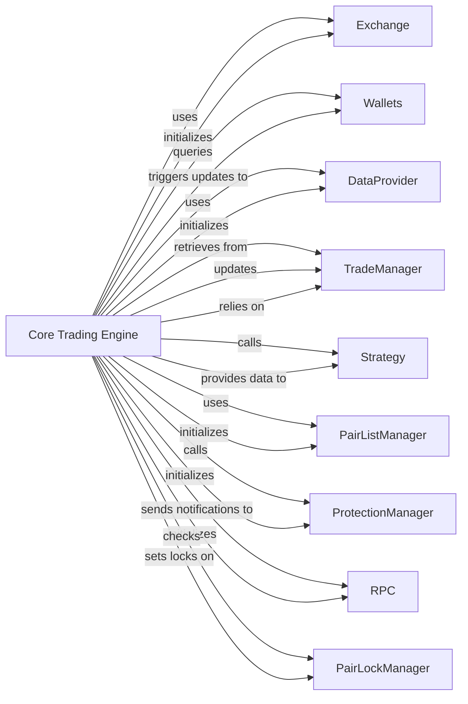

## Component Details

The `Core Trading Engine` is the central orchestrator of the Freqtrade application, primarily embodied by the `FreqtradeBot` class, with the `Worker` class serving as its high-level execution loop manager. It is responsible for managing the main trading loop, initializing and coordinating all other core components, handling trade entry and exit logic, and ensuring the overall flow of operations. It acts as the "brain" that drives trading decisions and actions, integrating data, strategy, and exchange interactions.

### Core Trading Engine

The central orchestrator of the Freqtrade application. The `Worker` class manages the bot's state and main execution loop, while the `FreqtradeBot` class contains the core trading logic, including trade entry, exit, and position management.

**Related Classes/Methods**:

- <a href="https://github.com/freqtrade/freqtrade/blob/master/freqtrade/freqtradebot.py#L1-L1" target="_blank" rel="noopener noreferrer">`freqtrade.freqtradebot:FreqtradeBot` (1:1)</a>

- <a href="https://github.com/freqtrade/freqtrade/blob/master/freqtrade/worker.py#L1-L1" target="_blank" rel="noopener noreferrer">`freqtrade.worker:Worker` (1:1)</a>

### Exchange

Provides an abstract interface for interacting with various cryptocurrency exchanges. It handles API calls for fetching market data, placing orders, managing positions, and querying account information.

**Related Classes/Methods**:

- <a href="https://github.com/freqtrade/freqtrade/blob/master/freqtrade/exchange/exchange.py#L1-L1" target="_blank" rel="noopener noreferrer">`freqtrade.exchange.exchange` (1:1)</a>

- <a href="https://github.com/freqtrade/freqtrade/blob/master/freqtrade/exchange/binance.py#L1-L1" target="_blank" rel="noopener noreferrer">`freqtrade.exchange.binance` (1:1)</a>

- <a href="https://github.com/freqtrade/freqtrade/blob/master/freqtrade/exchange/kraken.py#L1-L1" target="_blank" rel="noopener noreferrer">`freqtrade.exchange.kraken` (1:1)</a>

### Wallets

Manages the bot's financial state, including cryptocurrency balances, available funds, and stake amount calculations. It acts as the financial controller, ensuring trades adhere to available capital.

**Related Classes/Methods**:

- <a href="https://github.com/freqtrade/freqtrade/blob/master/freqtrade/wallets.py#L1-L1" target="_blank" rel="noopener noreferrer">`freqtrade.wallets` (1:1)</a>

### DataProvider

Serves as the primary interface for accessing and managing market data (historical OHLCV, real-time prices, trades). It abstracts the data source and provides cached data to other components.

**Related Classes/Methods**:

- <a href="https://github.com/freqtrade/freqtrade/blob/master/freqtrade/data/dataprovider.py#L1-L1" target="_blank" rel="noopener noreferrer">`freqtrade.data.dataprovider` (1:1)</a>

### TradeManager

Manages the lifecycle and persistence of individual trades (`Trade`) and their associated orders (`Order`). It handles trade updates, profit calculations, and database interactions.

**Related Classes/Methods**:

- <a href="https://github.com/freqtrade/freqtrade/blob/master/freqtrade/persistence/trade_model.py#L1-L1" target="_blank" rel="noopener noreferrer">`freqtrade.persistence.trade_model` (1:1)</a>

### Strategy

Encapsulates the trading logic and indicators. Users define their buy and sell signals, stop-loss, and profit-taking strategies within this component. It analyzes market data and provides recommendations to the `Core Trading Engine`.

**Related Classes/Methods**:

- <a href="https://github.com/freqtrade/freqtrade/blob/master/freqtrade/strategy/interface.py#L1-L1" target="_blank" rel="noopener noreferrer">`freqtrade.strategy.interface` (1:1)</a>

- <a href="https://github.com/freqtrade/freqtrade/blob/master/freqtrade/strategy/strategy_wrapper.py#L1-L1" target="_blank" rel="noopener noreferrer">`freqtrade.strategy.strategy_wrapper` (1:1)</a>

### PairListManager

Manages the list of cryptocurrency pairs that the bot is allowed to trade. It can apply various filters (e.g., volume, price, age) to dynamically select or exclude pairs.

**Related Classes/Methods**:

- <a href="https://github.com/freqtrade/freqtrade/blob/master/freqtrade/plugins/pairlistmanager.py#L1-L1" target="_blank" rel="noopener noreferrer">`freqtrade.plugins.pairlistmanager` (1:1)</a>

### ProtectionManager

Implements various protection mechanisms to safeguard the bot's capital and prevent excessive losses. This includes features like cooldown periods, max drawdown protection, and low-profit pair filtering.

**Related Classes/Methods**:

- <a href="https://github.com/freqtrade/freqtrade/blob/master/freqtrade/plugins/protectionmanager.py#L1-L1" target="_blank" rel="noopener noreferrer">`freqtrade.plugins.protectionmanager` (1:1)</a>

### RPC

Handles communication with external interfaces, such as Telegram bots, web UIs, or webhooks. It allows users to monitor the bot's status, receive notifications, and send commands.

**Related Classes/Methods**:

- <a href="https://github.com/freqtrade/freqtrade/blob/master/freqtrade/rpc/rpc_manager.py#L1-L1" target="_blank" rel="noopener noreferrer">`freqtrade.rpc.rpc_manager` (1:1)</a>

- <a href="https://github.com/freqtrade/freqtrade/blob/master/freqtrade/rpc/rpc.py#L1-L1" target="_blank" rel="noopener noreferrer">`freqtrade.rpc.rpc` (1:1)</a>

### PairLockManager

Ensures that trading operations on specific currency pairs are synchronized and prevents conflicting actions by implementing a locking mechanism.

**Related Classes/Methods**:

- <a href="https://github.com/freqtrade/freqtrade/blob/master/freqtrade/persistence/pairlock_middleware.py#L1-L1" target="_blank" rel="noopener noreferrer">`freqtrade.persistence.pairlock_middleware` (1:1)</a>

### [FAQ](https://github.com/CodeBoarding/GeneratedOnBoardings/tree/main?tab=readme-ov-file#faq)