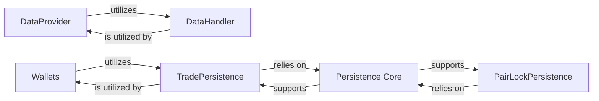

## Component Details

This subsystem is crucial for `freqtrade` as it handles all aspects of market data (live and historical) and the application's persistent state. It ensures data integrity, provides necessary data to other components, and maintains the bot's financial and operational status. The fundamental nature of these components lies in their role as the single source of truth for market information and the bot's internal state, enabling informed trading decisions and consistent operation.

### Wallets

Manages the bot's financial state, including cryptocurrency balances, available funds, and stake amount calculations. It provides an abstraction over real-time exchange balances and simulates balances in dry-run/backtest modes by integrating with trade data.

**Related Classes/Methods**:

- <a href="https://github.com/freqtrade/freqtrade/blob/master/freqtrade/wallets.py#L0-L0" target="_blank" rel="noopener noreferrer">`freqtrade/wallets.py` (0:0)</a>

### DataProvider

Serves as the primary interface for accessing and managing market data (historical OHLCV, real-time prices, trades). It abstracts the data source, provides cached data, and integrates with data handlers for efficient historical data retrieval.

**Related Classes/Methods**:

- <a href="https://github.com/freqtrade/freqtrade/blob/master/freqtrade/data/dataprovider.py#L0-L0" target="_blank" rel="noopener noreferrer">`freqtrade/data/dataprovider.py` (0:0)</a>

### DataHandler

Handles the low-level storage and retrieval of historical market data (OHLCV and trades) from various file formats (e.g., JSON, Feather, Parquet). It defines the contract (`IDataHandler`) for data handling and provides concrete implementations.

**Related Classes/Methods**:

- <a href="https://github.com/freqtrade/freqtrade/blob/master/freqtrade/data/history/datahandlers/idatahandler.py#L0-L0" target="_blank" rel="noopener noreferrer">`freqtrade/data/history/datahandlers/idatahandler.py` (0:0)</a>

- <a href="https://github.com/freqtrade/freqtrade/blob/master/freqtrade/data/history/datahandlers/jsondatahandler.py#L0-L0" target="_blank" rel="noopener noreferrer">`freqtrade/data/history/datahandlers/jsondatahandler.py` (0:0)</a>

- <a href="https://github.com/freqtrade/freqtrade/blob/master/freqtrade/data/history/datahandlers/featherdatahandler.py#L0-L0" target="_blank" rel="noopener noreferrer">`freqtrade/data/history/datahandlers/featherdatahandler.py` (0:0)</a>

- <a href="https://github.com/freqtrade/freqtrade/blob/master/freqtrade/data/history/datahandlers/parquetdatahandler.py#L0-L0" target="_blank" rel="noopener noreferrer">`freqtrade/data/history/datahandlers/parquetdatahandler.py` (0:0)</a>

### TradePersistence

Manages the persistence of individual trades (`Trade`) and their associated orders (`Order`). It defines the data models for trades and orders, handles their storage, retrieval, and updates within the database, and provides methods for querying and aggregating trade data.

**Related Classes/Methods**:

- <a href="https://github.com/freqtrade/freqtrade/blob/master/freqtrade/persistence/trade_model.py#L0-L0" target="_blank" rel="noopener noreferrer">`freqtrade/persistence/trade_model.py` (0:0)</a>

- <a href="https://github.com/freqtrade/freqtrade/blob/master/freqtrade/persistence/models.py#L0-L0" target="_blank" rel="noopener noreferrer">`freqtrade/persistence/models.py` (0:0)</a>

### PairLockPersistence

Manages the persistence and application of pair locks, which prevent conflicting trading actions on specific currency pairs. It stores and retrieves pair lock information from the database.

**Related Classes/Methods**:

- <a href="https://github.com/freqtrade/freqtrade/blob/master/freqtrade/persistence/pairlock_middleware.py#L0-L0" target="_blank" rel="noopener noreferrer">`freqtrade/persistence/pairlock_middleware.py` (0:0)</a>

- <a href="https://github.com/freqtrade/freqtrade/blob/master/freqtrade/persistence/pairlock.py#L0-L0" target="_blank" rel="noopener noreferrer">`freqtrade/persistence/pairlock.py` (0:0)</a>

- <a href="https://github.com/freqtrade/freqtrade/blob/master/freqtrade/persistence/models.py#L0-L0" target="_blank" rel="noopener noreferrer">`freqtrade/persistence/models.py` (0:0)</a>

### Persistence Core

Provides the foundational database models and base functionalities for all persistent data within the application. It acts as the central hub for defining and managing core database entities, including migrations and key-value storage, ensuring data integrity and consistency across the application's state.

**Related Classes/Methods**:

- <a href="https://github.com/freqtrade/freqtrade/blob/master/freqtrade/persistence/models.py#L0-L0" target="_blank" rel="noopener noreferrer">`freqtrade/persistence/models.py` (0:0)</a>

- <a href="https://github.com/freqtrade/freqtrade/blob/master/freqtrade/persistence/base.py#L0-L0" target="_blank" rel="noopener noreferrer">`freqtrade/persistence/base.py` (0:0)</a>

- <a href="https://github.com/freqtrade/freqtrade/blob/master/freqtrade/persistence/key_value_store.py#L0-L0" target="_blank" rel="noopener noreferrer">`freqtrade/persistence/key_value_store.py` (0:0)</a>

- <a href="https://github.com/freqtrade/freqtrade/blob/master/freqtrade/persistence/custom_data.py#L0-L0" target="_blank" rel="noopener noreferrer">`freqtrade/persistence/custom_data.py` (0:0)</a>

- <a href="https://github.com/freqtrade/freqtrade/blob/master/freqtrade/persistence/usedb_context.py#L0-L0" target="_blank" rel="noopener noreferrer">`freqtrade/persistence/usedb_context.py` (0:0)</a>

- <a href="https://github.com/freqtrade/freqtrade/blob/master/freqtrade/persistence/migrations.py#L0-L0" target="_blank" rel="noopener noreferrer">`freqtrade/persistence/migrations.py` (0:0)</a>

### [FAQ](https://github.com/CodeBoarding/GeneratedOnBoardings/tree/main?tab=readme-ov-file#faq)