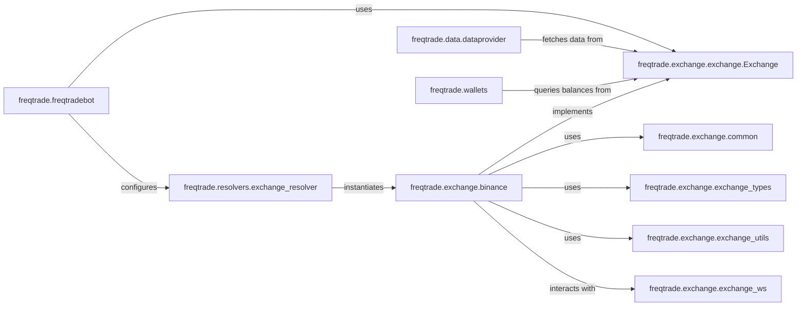

## Component Details

The `Exchange Integration` subsystem provides a robust and abstract layer for interacting with various cryptocurrency exchanges. Its primary purpose is to standardize exchange communication, allowing the rest of the `freqtrade` application to operate without needing to know the specifics of each exchange's API. This abstraction handles market data retrieval, order management, and account balance queries, ensuring a unified interface for trading operations.

### freqtrade.exchange.exchange.Exchange

This is the abstract base class that defines the core interface and common functionalities for all cryptocurrency exchange integrations. It serves as the blueprint for concrete exchange implementations, ensuring a consistent API for the rest of the `freqtrade` application.

**Related Classes/Methods**:

- <a href="https://github.com/freqtrade/freqtrade/blob/master/freqtrade/exchange/exchange.py#L118-L3829" target="_blank" rel="noopener noreferrer">`freqtrade.exchange.exchange.Exchange` (118:3829)</a>

### freqtrade.exchange.common

Contains shared utility functions, constants, and helper methods that are common across multiple exchange implementations. This module promotes code reuse and consistency in handling common exchange-related tasks.

**Related Classes/Methods**:

- <a href="https://github.com/freqtrade/freqtrade/blob/master/freqtrade/exchange/common.py#L1-L1" target="_blank" rel="noopener noreferrer">`freqtrade.exchange.common` (1:1)</a>

### freqtrade.exchange.exchange_types

Defines various data types, enums, and structures used throughout the exchange integration, such as order types, trade statuses, and market data structures (e.g., OHLCV). This ensures type safety and consistency in data representation.

**Related Classes/Methods**:

- <a href="https://github.com/freqtrade/freqtrade/blob/master/freqtrade/exchange/exchange_types.py#L1-L1" target="_blank" rel="noopener noreferrer">`freqtrade.exchange.exchange_types` (1:1)</a>

### freqtrade.exchange.exchange_utils

Provides general utility functions for exchange operations that are not specific to a single exchange but are broadly applicable. Examples include price rounding, amount precision handling, and other numerical manipulations required for trading.

**Related Classes/Methods**:

- <a href="https://github.com/freqtrade/freqtrade/blob/master/freqtrade/exchange/exchange_utils.py#L1-L1" target="_blank" rel="noopener noreferrer">`freqtrade.exchange.exchange_utils` (1:1)</a>

### freqtrade.exchange.exchange_ws

Handles WebSocket connections to exchanges, enabling real-time market data streaming (e.g., live tickers, order book updates) and potentially real-time order status updates. This is crucial for strategies requiring low-latency data.

**Related Classes/Methods**:

- <a href="https://github.com/freqtrade/freqtrade/blob/master/freqtrade/exchange/exchange_ws.py#L1-L1" target="_blank" rel="noopener noreferrer">`freqtrade.exchange.exchange_ws` (1:1)</a>

### freqtrade.exchange.binance

A concrete implementation of the `freqtrade.exchange.exchange.Exchange` abstract base class, providing the specific logic for interacting with the Binance exchange's API. This includes methods for fetching data, placing orders, and managing accounts on Binance.

**Related Classes/Methods**:

- <a href="https://github.com/freqtrade/freqtrade/blob/master/freqtrade/exchange/binance.py#L1-L1" target="_blank" rel="noopener noreferrer">`freqtrade.exchange.binance` (1:1)</a>

### freqtrade.resolvers.exchange_resolver

This component is responsible for dynamically selecting and initializing the correct concrete exchange implementation (e.g., `Binance`, `Bybit`) based on the bot's configuration. It acts as a factory for exchange objects.

**Related Classes/Methods**:

- <a href="https://github.com/freqtrade/freqtrade/blob/master/freqtrade/resolvers/exchange_resolver.py#L1-L1" target="_blank" rel="noopener noreferrer">`freqtrade.resolvers.exchange_resolver` (1:1)</a>

### freqtrade.freqtradebot

The main orchestration component of the `freqtrade` application. It utilizes the `Exchange Integration` to execute trading strategies, manage positions, and interact with the market.

**Related Classes/Methods**:

- <a href="https://github.com/freqtrade/freqtrade/blob/master/freqtrade/freqtradebot.py#L1-L1" target="_blank" rel="noopener noreferrer">`freqtrade.freqtradebot` (1:1)</a>

### freqtrade.data.dataprovider

This component is responsible for providing market data to various parts of the `freqtrade` system. It relies on the `Exchange Integration` to fetch historical and real-time market data (e.g., OHLCV candles, tickers).

**Related Classes/Methods**:

- <a href="https://github.com/freqtrade/freqtrade/blob/master/freqtrade/data/dataprovider.py#L1-L1" target="_blank" rel="noopener noreferrer">`freqtrade.data.dataprovider` (1:1)</a>

### freqtrade.wallets

Manages the bot's cryptocurrency balances and portfolio. It interacts with the `Exchange Integration` to query current account balances, available funds, and leverage information from the connected exchange.

**Related Classes/Methods**:

- <a href="https://github.com/freqtrade/freqtrade/blob/master/freqtrade/wallets.py#L1-L1" target="_blank" rel="noopener noreferrer">`freqtrade.wallets` (1:1)</a>

### [FAQ](https://github.com/CodeBoarding/GeneratedOnBoardings/tree/main?tab=readme-ov-file#faq)