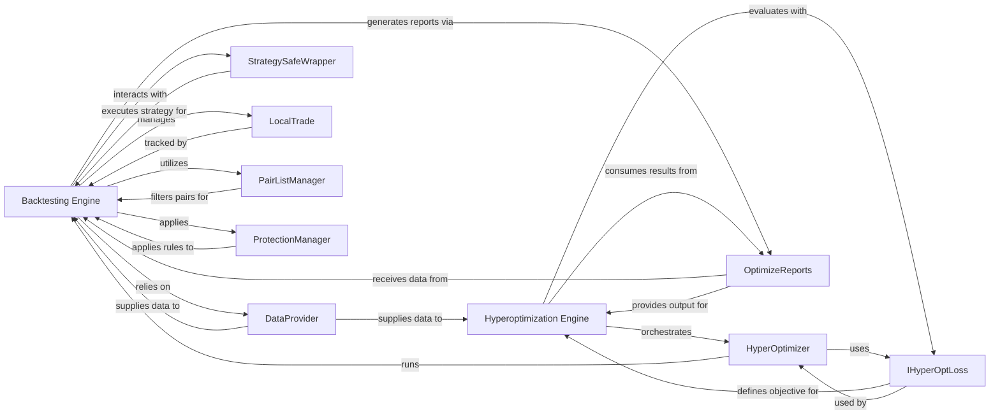

## Component Details

The `Optimization & Simulation` subsystem provides a robust environment for evaluating and refining trading strategies without real capital risk. It encompasses two primary engines: the `Backtesting Engine` for simulating strategy performance on historical data, and the `Hyperoptimization Engine` for automatically discovering optimal strategy parameters. This overview details the structure, flow, and purpose of the most fundamental components within this subsystem.

### Backtesting Engine

The core component for simulating trading strategies on historical data. It orchestrates the entire backtesting process, including data loading, strategy execution, trade management, and performance calculation.

**Related Classes/Methods**:

- <a href="https://github.com/freqtrade/freqtrade/blob/master/freqtrade/optimize/backtesting.py#L1-L1" target="_blank" rel="noopener noreferrer">`freqtrade.optimize.backtesting` (1:1)</a>

### Hyperoptimization Engine

Automates the process of finding optimal parameters for a trading strategy. It defines the hyperparameter search space, runs multiple backtest trials, and uses an optimization algorithm (e.g., Optuna) to identify the best parameter combinations based on a defined loss function.

**Related Classes/Methods**:

- <a href="https://github.com/freqtrade/freqtrade/blob/master/freqtrade/optimize/hyperopt/hyperopt.py#L1-L1" target="_blank" rel="noopener noreferrer">`freqtrade.optimize.hyperopt.hyperopt` (1:1)</a>

### HyperOptimizer

Acts as the bridge between the Hyperopt process and the Backtesting engine. It's responsible for setting up and running individual backtest trials within the hyperoptimization loop, passing the specific hyperparameter combinations to the Backtesting engine.

**Related Classes/Methods**:

- <a href="https://github.com/freqtrade/freqtrade/blob/master/freqtrade/optimize/hyperopt/hyperopt_optimizer.py#L1-L1" target="_blank" rel="noopener noreferrer">`freqtrade.optimize.hyperopt.hyperopt_optimizer` (1:1)</a>

### DataProvider

Responsible for fetching, caching, and providing historical OHLCV (Open, High, Low, Close, Volume) data to the backtesting and hyperoptimization processes.

**Related Classes/Methods**:

- <a href="https://github.com/freqtrade/freqtrade/blob/master/freqtrade/data/dataprovider.py#L1-L1" target="_blank" rel="noopener noreferrer">`freqtrade.data.dataprovider` (1:1)</a>

### StrategySafeWrapper

Provides a safe execution environment for user-defined trading strategies. It handles the invocation of strategy methods (e.g., populate_indicators, populate_entry_trend, populate_exit_trend) and manages potential errors.

**Related Classes/Methods**:

- <a href="https://github.com/freqtrade/freqtrade/blob/master/freqtrade/strategy/strategy_wrapper.py#L1-L1" target="_blank" rel="noopener noreferrer">`freqtrade.strategy.strategy_wrapper` (1:1)</a>

### LocalTrade

Represents and manages simulated trade objects within the backtesting environment. It tracks trade details, entry/exit points, profit/loss, and other relevant metrics.

**Related Classes/Methods**:

- <a href="https://github.com/freqtrade/freqtrade/blob/master/freqtrade/persistence/trade_model.py#L1-L1" target="_blank" rel="noopener noreferrer">`freqtrade.persistence.trade_model` (1:1)</a>

### OptimizeReports

Generates comprehensive reports and statistics from backtest results, including profit/loss, drawdowns, trade counts, and other performance metrics.

**Related Classes/Methods**:

- <a href="https://github.com/freqtrade/freqtrade/blob/master/freqtrade/optimize/optimize_reports/optimize_reports.py#L1-L1" target="_blank" rel="noopener noreferrer">`freqtrade.optimize.optimize_reports.optimize_reports` (1:1)</a>

### IHyperOptLoss

Defines the interface for objective functions (loss functions) that Hyperopt tries to minimize or maximize during the optimization process. Various implementations exist for different optimization goals (e.g., maximizing profit, minimizing drawdown).

**Related Classes/Methods**:

- <a href="https://github.com/freqtrade/freqtrade/blob/master/freqtrade/optimize/hyperopt_loss/hyperopt_loss_interface.py#L1-L1" target="_blank" rel="noopener noreferrer">`freqtrade.optimize.hyperopt_loss.hyperopt_loss_interface` (1:1)</a>

### PairListManager

Manages and filters the list of trading pairs based on various criteria (e.g., volume, price, age). This ensures that the backtest or hyperoptimization runs only on relevant and tradable pairs.

**Related Classes/Methods**:

- <a href="https://github.com/freqtrade/freqtrade/blob/master/freqtrade/plugins/pairlistmanager.py#L1-L1" target="_blank" rel="noopener noreferrer">`freqtrade.plugins.pairlistmanager` (1:1)</a>

### ProtectionManager

Applies various protection mechanisms during backtesting, such as cooldown periods, max drawdown limits, or low-profit pair exclusions, to simulate real-world risk management.

**Related Classes/Methods**:

- <a href="https://github.com/freqtrade/freqtrade/blob/master/freqtrade/plugins/protectionmanager.py#L1-L1" target="_blank" rel="noopener noreferrer">`freqtrade.plugins.protectionmanager` (1:1)</a>

### [FAQ](https://github.com/CodeBoarding/GeneratedOnBoardings/tree/main?tab=readme-ov-file#faq)