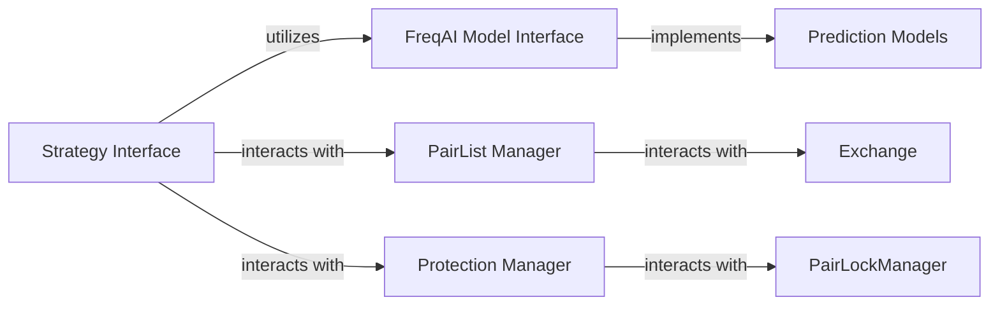

## Component Details

The `Trading Logic & Control` component is the brain of the Freqtrade bot, responsible for defining and executing the core trading strategy. It encompasses the calculation of technical indicators, the generation of entry and exit signals, the dynamic management of tradable pairs, the integration of AI/ML models for predictive analysis, and the implementation of various safety measures.

### Strategy Interface

This is the abstract base class that all custom trading strategies must inherit from. It defines the fundamental structure and methods for calculating indicators (`populate_indicators`), generating entry and exit signals (`populate_entry_trend`, `populate_exit_trend`), and implementing custom trade management logic (e.g., `custom_stoploss`, `custom_roi`, `adjust_trade_position`, `custom_stake_amount`). It also provides hooks for interacting with FreqAI and pair locking mechanisms.

**Related Classes/Methods**:

- <a href="https://github.com/freqtrade/freqtrade/blob/master/freqtrade/strategy/interface.py#L1-L1" target="_blank" rel="noopener noreferrer">`freqtrade.strategy.interface.IStrategy` (1:1)</a>

### FreqAI Model Interface

This abstract class serves as the primary interface for integrating Artificial Intelligence and Machine Learning models into Freqtrade strategies. It defines the contract for training (`train`, `fit`) and making predictions (`predict`) using various AI/ML algorithms. It also manages the data pipeline for feature engineering and handles the lifecycle of AI models during live trading and backtesting.

**Related Classes/Methods**:

- <a href="https://github.com/freqtrade/freqtrade/blob/master/freqtrade/freqai/freqai_interface.py#L35-L1044" target="_blank" rel="noopener noreferrer">`freqtrade.freqai.freqai_interface.IFreqaiModel` (35:1044)</a>

### Prediction Models

These are concrete implementations of the `IFreqaiModel` interface, providing specific AI/ML algorithms (e.g., CatBoost, LightGBM, PyTorch models) that the bot can use for predictive analysis. They contain the actual machine learning code for fitting models to data and generating predictions.

**Related Classes/Methods**:

- <a href="https://github.com/freqtrade/freqtrade/blob/master/freqtrade/freqai/prediction_models/CatboostClassifier.py#L13-L60" target="_blank" rel="noopener noreferrer">`freqtrade.freqai.prediction_models.CatboostClassifier` (13:60)</a>

### PairList Manager

This component is responsible for dynamically managing the list of tradable currency pairs (the "whitelist") and non-tradable pairs (the "blacklist"). It utilizes various pairlist plugins to generate and filter the active trading universe based on criteria such as volume, price, and market capitalization, ensuring the bot operates on relevant and liquid assets.

**Related Classes/Methods**:

- <a href="https://github.com/freqtrade/freqtrade/blob/master/freqtrade/plugins/pairlistmanager.py#L1-L1" target="_blank" rel="noopener noreferrer">`freqtrade.plugins.pairlistmanager.PairListManager` (1:1)</a>

### Protection Manager

This component implements various safety measures and trading restrictions, known as "protections," to safeguard against excessive losses or overtrading. It can apply global trading stops or pair-specific locks based on predefined rules, acting as a critical risk mitigation layer.

**Related Classes/Methods**:

- <a href="https://github.com/freqtrade/freqtrade/blob/master/freqtrade/plugins/protectionmanager.py#L1-L1" target="_blank" rel="noopener noreferrer">`freqtrade.plugins.protectionmanager.ProtectionManager` (1:1)</a>

### Exchange

Represents the cryptocurrency exchange interface, providing market data and trading functionalities.

**Related Classes/Methods**: _None_

### PairLockManager

Manages the locking and unlocking of trading pairs to enforce restrictions.

**Related Classes/Methods**: _None_

### [FAQ](https://github.com/CodeBoarding/GeneratedOnBoardings/tree/main?tab=readme-ov-file#faq)