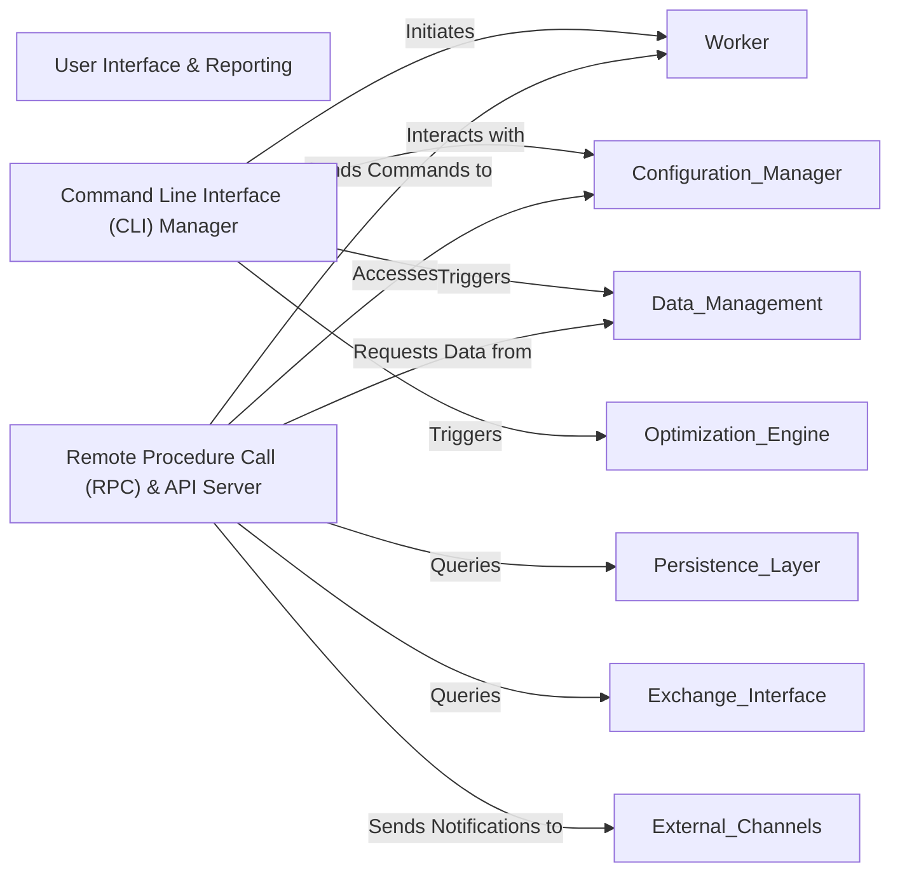

## Component Details

The `User Interface & Reporting` component serves as the primary gateway for users to interact with the `freqtrade` bot and receive critical updates. It centralizes all remote procedure call (RPC) functionalities, command-line interface (CLI) parsing, and web API services. This comprehensive component enables external control and notifications through various channels, including a Web API, Telegram, Discord, and Webhook, allowing users to effectively monitor and manage the bot's operations.

### User Interface & Reporting

The `User Interface & Reporting` component serves as the primary gateway for users to interact with the `freqtrade` bot and receive critical updates. It centralizes all remote procedure call (RPC) functionalities, command-line interface (CLI) parsing, and web API services. This comprehensive component enables external control and notifications through various channels, including a Web API, Telegram, Discord, and Webhook, allowing users to effectively monitor and manage the bot's operations.

**Related Classes/Methods**: _None_

### Command Line Interface (CLI) Manager

This component is responsible for parsing command-line arguments, validating user input, and dispatching commands to the appropriate internal functions of the `freqtrade` bot. It serves as the primary text-based interface for users to control and interact with the bot, initiating various operations like starting the trading worker, managing data, or running optimizations.

**Related Classes/Methods**:

- <a href="https://github.com/freqtrade/freqtrade/blob/master/freqtrade/commands/arguments.py#L0-L0" target="_blank" rel="noopener noreferrer">`freqtrade/commands/arguments.py` (0:0)</a>

- <a href="https://github.com/freqtrade/freqtrade/blob/master/freqtrade/commands/trade_commands.py#L8-L29" target="_blank" rel="noopener noreferrer">`freqtrade/commands/trade_commands.py:start_trading` (8:29)</a>

- <a href="https://github.com/freqtrade/freqtrade/blob/master/freqtrade/commands/data_commands.py#L0-L0" target="_blank" rel="noopener noreferrer">`freqtrade/commands/data_commands.py` (0:0)</a>

- <a href="https://github.com/freqtrade/freqtrade/blob/master/freqtrade/commands/optimize_commands.py#L0-L0" target="_blank" rel="noopener noreferrer">`freqtrade/commands/optimize_commands.py` (0:0)</a>

- <a href="https://github.com/freqtrade/freqtrade/blob/master/freqtrade/commands/webserver_commands.py#L0-L0" target="_blank" rel="noopener noreferrer">`freqtrade/commands/webserver_commands.py` (0:0)</a>

### Remote Procedure Call (RPC) & API Server

This component provides a comprehensive set of interfaces for external control and real-time notifications. It encompasses a Web API (REST and WebSocket), and integrations with messaging platforms like Telegram, Discord, and Webhook. It listens for incoming requests, authenticates them, translates external commands into internal bot actions, and sends out status updates, trade notifications, and other relevant information to connected clients.

**Related Classes/Methods**:

- <a href="https://github.com/freqtrade/freqtrade/blob/master/freqtrade/rpc/rpc_manager.py#L0-L0" target="_blank" rel="noopener noreferrer">`freqtrade/rpc/rpc_manager.py` (0:0)</a>

- <a href="https://github.com/freqtrade/freqtrade/blob/master/freqtrade/rpc/api_server/webserver.py#L0-L0" target="_blank" rel="noopener noreferrer">`freqtrade/rpc/api_server/webserver.py` (0:0)</a>

- <a href="https://github.com/freqtrade/freqtrade/blob/master/freqtrade/rpc/api_server/api_v1.py#L0-L0" target="_blank" rel="noopener noreferrer">`freqtrade/rpc/api_server/api_v1.py` (0:0)</a>

- <a href="https://github.com/freqtrade/freqtrade/blob/master/freqtrade/rpc/telegram.py#L0-L0" target="_blank" rel="noopener noreferrer">`freqtrade/rpc/telegram.py` (0:0)</a>

- <a href="https://github.com/freqtrade/freqtrade/blob/master/freqtrade/rpc/discord.py#L0-L0" target="_blank" rel="noopener noreferrer">`freqtrade/rpc/discord.py` (0:0)</a>

- <a href="https://github.com/freqtrade/freqtrade/blob/master/freqtrade/rpc/webhook.py#L0-L0" target="_blank" rel="noopener noreferrer">`freqtrade/rpc/webhook.py` (0:0)</a>

### [FAQ](https://github.com/CodeBoarding/GeneratedOnBoardings/tree/main?tab=readme-ov-file#faq)