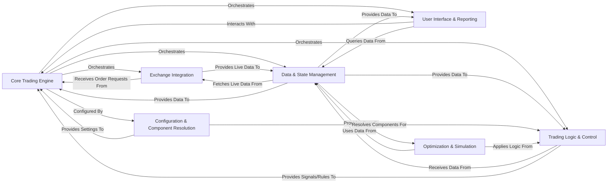

## Component Details

Here's the final architecture analysis for `freqtrade`, consolidating the components into a high-level overview with their responsibilities, key source files, and critical relationships.

### Core Trading Engine

The central orchestrator of the Freqtrade application. It manages the main trading loop, initializes and coordinates all other core components, handles trade entry and exit logic, and ensures the overall flow of operations. It's the "brain" that drives the trading decisions and actions.

**Related Classes/Methods**:

- <a href="https://github.com/freqtrade/freqtrade/blob/master/freqtrade/freqtradebot.py#L0-L0" target="_blank" rel="noopener noreferrer">`freqtrade.freqtradebot` (0:0)</a>

- <a href="https://github.com/freqtrade/freqtrade/blob/master/freqtrade/worker.py#L0-L0" target="_blank" rel="noopener noreferrer">`freqtrade.worker` (0:0)</a>

### Exchange Integration

Provides an abstraction layer for interacting with various cryptocurrency exchanges. It handles all low-level communication, including fetching market data (OHLCV, tickers, order books), placing and cancelling orders, and managing account balances and leverage.

**Related Classes/Methods**:

- <a href="https://github.com/freqtrade/freqtrade/blob/master/freqtrade/exchange/exchange.py#L0-L0" target="_blank" rel="noopener noreferrer">`freqtrade.exchange.exchange` (0:0)</a>

- `freqtrade.exchange` (0:0)

### Trading Logic & Control

Defines the core trading logic, including indicator calculation, generation of entry and exit signals, and management of trade positions. It also integrates AI/ML models for predictive analysis, implements various safety measures to prevent excessive losses or overtrading, and dynamically manages the list of tradable pairs.

**Related Classes/Methods**:

- <a href="https://github.com/freqtrade/freqtrade/blob/master/freqtrade/strategy/interface.py#L0-L0" target="_blank" rel="noopener noreferrer">`freqtrade.strategy.interface` (0:0)</a>

- `freqtrade.templates` (0:0)

- <a href="https://github.com/freqtrade/freqtrade/blob/master/freqtrade/freqai/freqai_interface.py#L0-L0" target="_blank" rel="noopener noreferrer">`freqtrade.freqai.freqai_interface` (0:0)</a>

- `freqtrade.freqai.prediction_models` (0:0)

- <a href="https://github.com/freqtrade/freqtrade/blob/master/freqtrade/plugins/pairlistmanager.py#L0-L0" target="_blank" rel="noopener noreferrer">`freqtrade.plugins.pairlistmanager` (0:0)</a>

- <a href="https://github.com/freqtrade/freqtrade/blob/master/freqtrade/plugins/protectionmanager.py#L0-L0" target="_blank" rel="noopener noreferrer">`freqtrade.plugins.protectionmanager` (0:0)</a>

### Data & State Management

Manages all market data (live and historical), and the application's persistent state, including open/closed trades, orders, pair locks, and the bot's financial state (wallet balances, profit/loss). It ensures data integrity and provides data to other components.

**Related Classes/Methods**:

- <a href="https://github.com/freqtrade/freqtrade/blob/master/freqtrade/data/dataprovider.py#L0-L0" target="_blank" rel="noopener noreferrer">`freqtrade.data.dataprovider` (0:0)</a>

- <a href="https://github.com/freqtrade/freqtrade/blob/master/freqtrade/data/history/datahandlers/idatahandler.py#L0-L0" target="_blank" rel="noopener noreferrer">`freqtrade.data.history.datahandlers.idatahandler` (0:0)</a>

- `freqtrade.data.history.datahandlers` (0:0)

- <a href="https://github.com/freqtrade/freqtrade/blob/master/freqtrade/persistence/models.py#L0-L0" target="_blank" rel="noopener noreferrer">`freqtrade.persistence.models` (0:0)</a>

- <a href="https://github.com/freqtrade/freqtrade/blob/master/freqtrade/persistence/trade_model.py#L0-L0" target="_blank" rel="noopener noreferrer">`freqtrade.persistence.trade_model` (0:0)</a>

- <a href="https://github.com/freqtrade/freqtrade/blob/master/freqtrade/persistence/pairlock_middleware.py#L0-L0" target="_blank" rel="noopener noreferrer">`freqtrade.persistence.pairlock_middleware` (0:0)</a>

- <a href="https://github.com/freqtrade/freqtrade/blob/master/freqtrade/wallets.py#L0-L0" target="_blank" rel="noopener noreferrer">`freqtrade.wallets` (0:0)</a>

### Configuration & Component Resolution

Responsible for loading, parsing, and validating the bot's configuration from various sources (files, environment variables, command-line arguments). It also dynamically locates and loads various components (strategies, exchanges, pairlists, protections, FreqAI models) based on their configured names or paths.

**Related Classes/Methods**:

- <a href="https://github.com/freqtrade/freqtrade/blob/master/freqtrade/configuration/configuration.py#L0-L0" target="_blank" rel="noopener noreferrer">`freqtrade.configuration.configuration` (0:0)</a>

- <a href="https://github.com/freqtrade/freqtrade/blob/master/freqtrade/resolvers/iresolver.py#L0-L0" target="_blank" rel="noopener noreferrer">`freqtrade.resolvers.iresolver` (0:0)</a>

- `freqtrade.resolvers` (0:0)

### User Interface & Reporting

Centralizes all remote procedure call (RPC) functionalities, command-line interface (CLI) parsing, and web API services. It enables external control and notifications through various channels like Telegram, Discord, Webhook, and a Web API, allowing users to interact with and monitor the bot.

**Related Classes/Methods**:

- <a href="https://github.com/freqtrade/freqtrade/blob/master/freqtrade/rpc/rpc_manager.py#L0-L0" target="_blank" rel="noopener noreferrer">`freqtrade.rpc.rpc_manager` (0:0)</a>

- <a href="https://github.com/freqtrade/freqtrade/blob/master/freqtrade/commands/arguments.py#L0-L0" target="_blank" rel="noopener noreferrer">`freqtrade.commands.arguments` (0:0)</a>

- `freqtrade.commands` (0:0)

- <a href="https://github.com/freqtrade/freqtrade/blob/master/freqtrade/rpc/api_server/webserver.py#L0-L0" target="_blank" rel="noopener noreferrer">`freqtrade.rpc.api_server.webserver` (0:0)</a>

### Optimization & Simulation

Provides tools for evaluating trading strategies without risking real capital. The Backtesting Engine simulates trading on historical data, while the Hyperoptimization Engine automates the process of finding optimal strategy parameters by running numerous backtests.

**Related Classes/Methods**:

- <a href="https://github.com/freqtrade/freqtrade/blob/master/freqtrade/optimize/backtesting.py#L0-L0" target="_blank" rel="noopener noreferrer">`freqtrade.optimize.backtesting` (0:0)</a>

- <a href="https://github.com/freqtrade/freqtrade/blob/master/freqtrade/optimize/hyperopt/hyperopt.py#L0-L0" target="_blank" rel="noopener noreferrer">`freqtrade.optimize.hyperopt.hyperopt` (0:0)</a>

### [FAQ](https://github.com/CodeBoarding/GeneratedOnBoardings/tree/main?tab=readme-ov-file#faq)